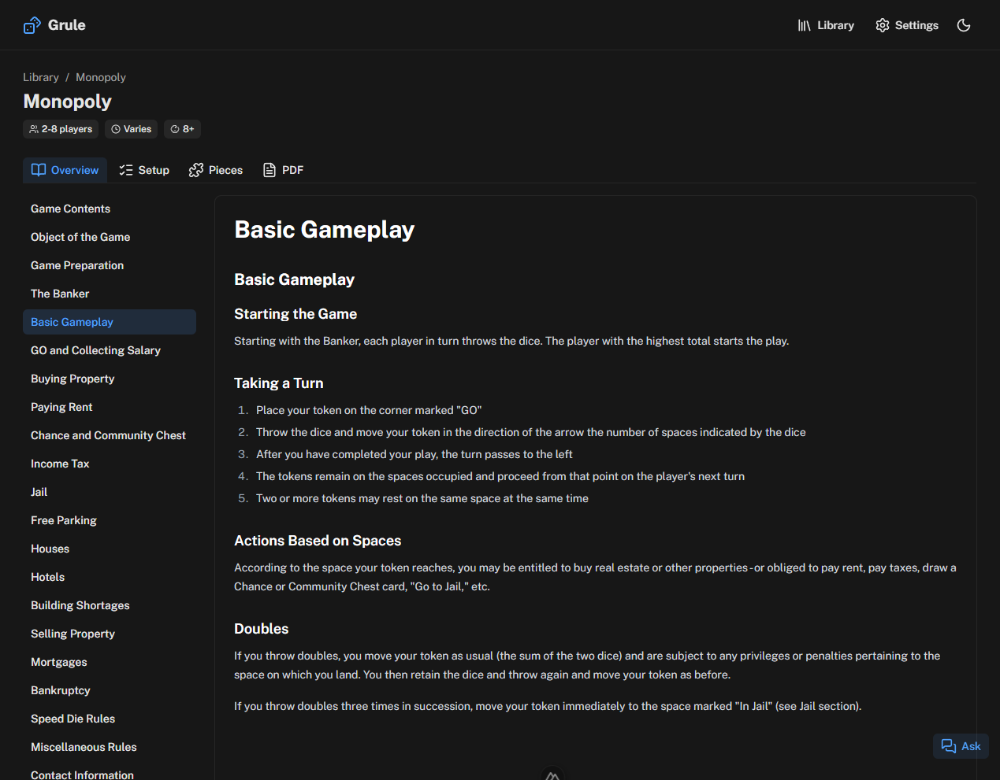
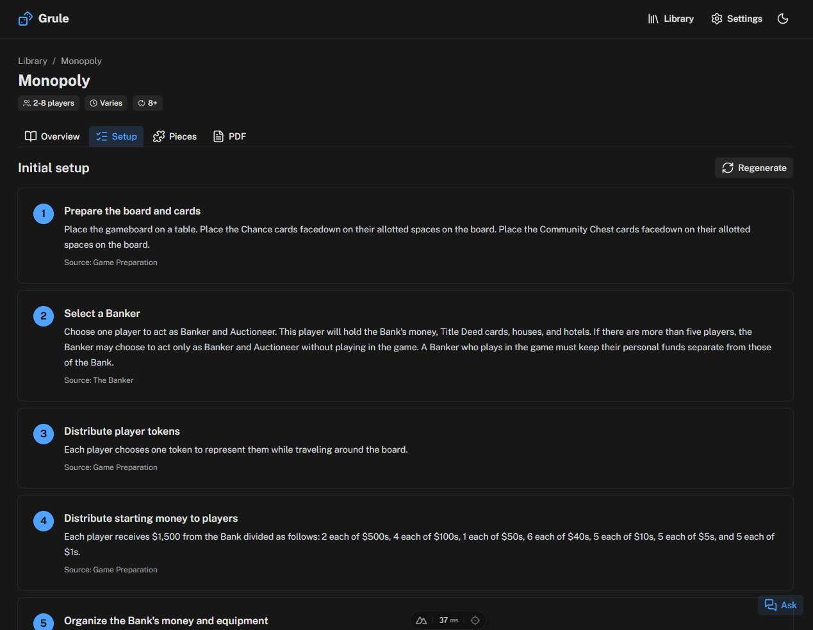
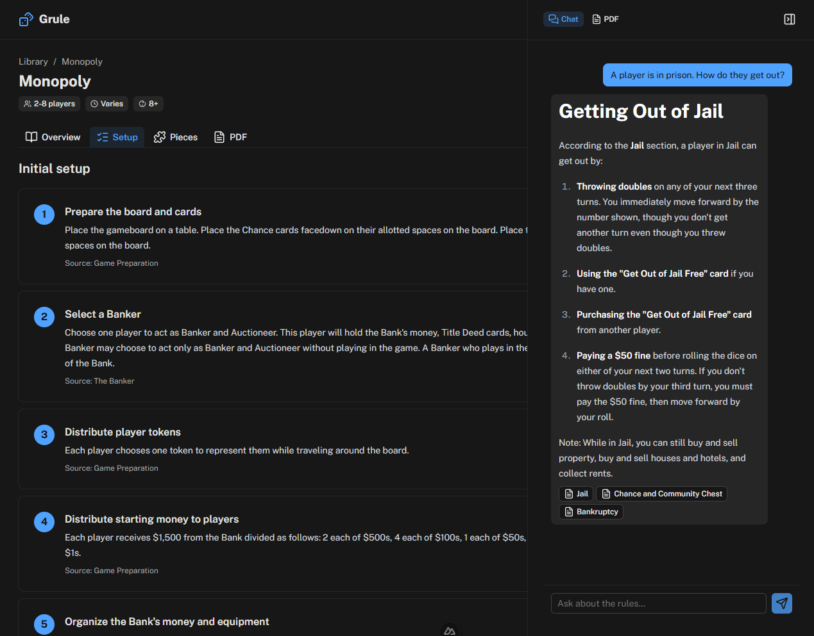

# Grule — Board game rulebook AI assistant

Upload a board game rulebook (PDF) and Grule analyzes it, splits it into
Markdown sections, and gives you:

- **Chat** — ask any rules question, answered via RAG (vector search) over the rulebook.
- **Setup** — a generated step-by-step initial-setup guide.
- **Pieces** — every component of the game catalogued and explained.

Single-user, local-first. Everything (uploaded PDFs, generated Markdown, the
SQLite database with embeddings) lives under `./data`.

## Showcase





## Tech stack

- **Nuxt 4** + **Nuxt UI** (Tailwind v4)
- **Vercel AI SDK v6** (`ai`, `@ai-sdk/vue`) with user-selectable providers:
  **Anthropic**, **OpenAI**, and **local LM Studio** (`@ai-sdk/openai-compatible`)
- **better-sqlite3** + **sqlite-vec** — single-file DB with native vector search
- **unpdf** for PDF text extraction
- Raw SQL data layer (schema created idempotently at boot in `server/utils/db.ts`)

## Setup

```bash
npm install
cp .env.example .env   # then fill in the providers you want
npm run dev            # http://localhost:3000
```

### Configure providers

API keys are read from environment variables (server-only); provider/model
*selection* is configured in the app at **/settings**.

| Variable | Purpose |
|---|---|
| `NUXT_OPENAI_API_KEY` | OpenAI chat and/or embeddings |
| `NUXT_ANTHROPIC_API_KEY` | Anthropic chat (no embeddings API) |
| `NUXT_LMSTUDIO_BASE_URL` | LM Studio server, default `http://localhost:1234/v1` |
| `NUXT_DATA_DIR` | Storage location, default `./data` |

> **Embeddings:** Anthropic has no embeddings endpoint. Pick **OpenAI** or
> **LM Studio** for the embedding model (you can still use Anthropic for chat).
> For LM Studio, load both a chat model and an embedding model in the app and
> start its local server.

## Running fully local with LM Studio

LM Studio lets you run everything offline — no API keys, no cloud. You need
**two** models loaded: one chat model (for analysis + answers) and one embedding
model (for RAG search).

1. **Install LM Studio** from [lmstudio.ai](https://lmstudio.ai) and open it.

2. **Download a chat model.** In the *Discover* (search) tab, pick a capable
   instruct model that fits your machine, e.g. `qwen2.5-7b-instruct` or
   `llama-3.1-8b-instruct`. Prefer a model with a large context window — the
   rulebook-splitting step sends a lot of text at once.
   - The chat model must support **structured output / JSON** (Grule uses it for
     splitting, setup, and pieces). Most modern instruct models in LM Studio do.

3. **Download an embedding model.** Still in *Discover*, search for an embedding
   model such as `text-embedding-nomic-embed-text-v1.5` or
   `text-embedding-bge-small-en-v1.5`.

4. **Start the local server.** Go to the *Developer* (or *Local Server*) tab and
   click **Start Server**. It listens on `http://localhost:1234` by default,
   exposing an OpenAI-compatible API at `http://localhost:1234/v1`.
   - Make sure **both** models are loaded/available. Enabling "Just-In-Time model
     loading" in LM Studio lets the server load each model on demand.

5. **Point Grule at it** (only needed if you changed the port/host). In `.env`:

   ```bash
   NUXT_LMSTUDIO_BASE_URL=http://localhost:1234/v1
   ```

6. **Select the models in Grule.** Open **/settings** and:
   - **Chat & analysis model** → provider **LM Studio**, model = the chat model's
     identifier exactly as LM Studio lists it (e.g. `qwen2.5-7b-instruct`).
   - **Embedding model** → provider **LM Studio**, model = the embedding model's
     identifier (e.g. `text-embedding-nomic-embed-text-v1.5`).
   - Click **Test connection** on each — chat returns "ok", embedding reports a
     vector dimension.

   > Tip: the exact identifier to use is the model's API name shown in LM Studio's
   > server panel / model list. You can also list them at
   > `http://localhost:1234/v1/models`.

7. Save settings, then upload a rulebook. Ingestion and chat now run entirely on
   your machine.

**Notes**
- Keep LM Studio's server running while you use Grule.
- Larger rulebooks need a chat model with enough context length; if splitting
  fails or truncates, choose a longer-context model or a smaller PDF.
- You can mix providers — e.g. Anthropic for chat and LM Studio for embeddings.
- **Reasoning models** (e.g. Qwen3) work, but their "thinking" makes the analysis
  step several times slower. For faster ingestion, turn **off** the model's
  reasoning/thinking in LM Studio, or choose a non-reasoning instruct model.
  Grule already allocates a generous output-token budget so thinking doesn't
  starve the JSON output.
- Grule asks the model for **JSON-schema-structured output**. LM Studio supports
  this natively; the app enables it automatically for the LM Studio provider.

## How it works

1. **Upload** (`POST /api/games`) saves the PDF and kicks off background ingestion.
2. **Ingestion** (`server/utils/ingest.ts`) runs as resumable stages — extract →
   split → embed → setup → pieces:
   - Extracts text **per page** so chunks keep their source page number.
   - AI splits the rulebook into Markdown sections (for the reader).
   - Chunks the raw per-page text and embeds it (`embedMany`) into a
     per-dimension `sqlite-vec` table.
   - Pre-generates the setup guide and pieces list (`generateObject`).
   - Each stage is recorded in a structured **step log** on the game and shown
     live in the UI. Progress is polled via `GET /api/games/:id`.
3. **Chat** (`POST /api/games/:id/chat`): embeds the question, vector-searches
   the game's chunks, and streams a grounded answer that **cites page numbers**.
   History is persisted.

### Chat sidebar
Chat lives in a **persistent right-hand sidebar** (not a tab), so you can ask
questions without leaving the Overview/Setup/Pieces tab you're on. The game shell
is a nested-route parent (`app/pages/games/[id].vue`) that stays mounted while the
tab content (`<NuxtPage>`) swaps, so the conversation survives tab switches. The
sidebar can also **show the PDF inline** — clicking a page citation flips it to
the PDF at that page, so you never lose your place in the main view.

### Viewing the PDF
The original upload is served at `GET /api/games/:id/pdf`, viewable inline in the
chat sidebar and full-screen in the **PDF** tab. Page references use the
`#page=N` fragment to jump the browser's PDF viewer to that page.

### Resuming a failed run
If ingestion fails partway (e.g. a provider rate-limit), the game shows the
failed step and a **Retry** button (`POST /api/games/:id/reprocess`). Reprocessing
**skips stages whose output already exists**, so it continues from where it left
off instead of redoing the expensive split/embed work.

Each game records the embedding model used at ingestion, so changing the
embedding provider later only affects newly uploaded games.

## Scripts

```bash
npm run dev        # dev server
npm run build      # production build
npm run typecheck  # vue-tsc type check
npm run lint       # eslint
```
